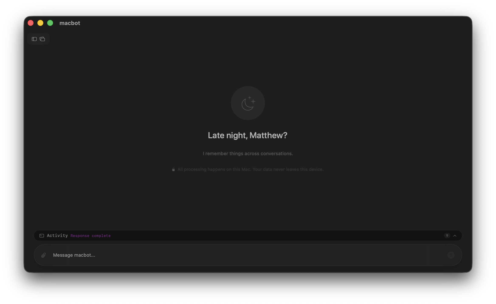
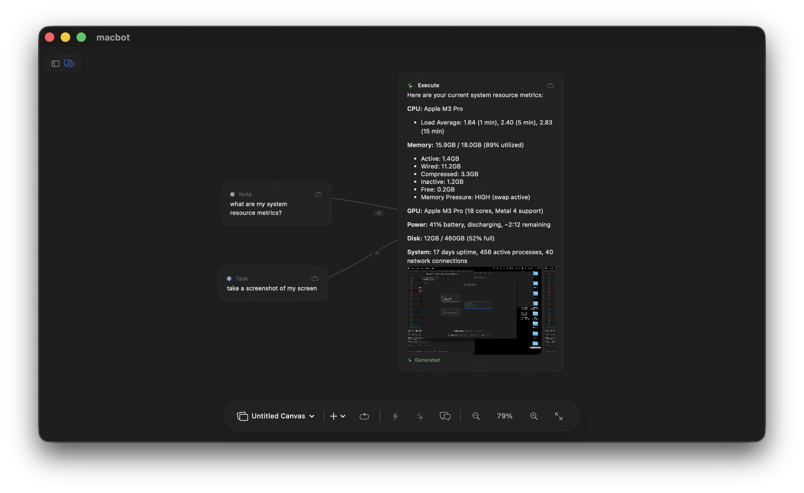

<p align="center">
  
</p>

<h1 align="center">macbot</h1>

<p align="center">
  Native macOS AI assistant — private, on-device, always aware.
</p>

<p align="center">
  
  
  
</p>

## Download

**[Download macbot.zip](https://github.com/matthewbmerino/macbot/releases/latest/download/macbot.zip)** — unzip, drag to Applications, double-click to run.

> First launch: right-click the app → **Open** (required once since the app isn't notarized).

---

### Chat

Multi-agent AI with tool calling, vision, code generation, and RAG — all running locally via Ollama.



### Canvas

Infinite workspace for visual thinking. Write notes, connect ideas, and execute them with AI — one click.



---

## Install

```bash
brew install ollama
ollama serve &
ollama pull qwen3.5:9b
ollama pull qwen3-embedding:0.6b

git clone https://github.com/matthewbmerino/macbot
cd macbot
./bundle.sh
open macbot.app
```

macbot detects your Mac's hardware and selects the best model automatically. Grant **Accessibility** and **Screen Recording** in System Settings when prompted.

## Features

**Chat** — Five specialized agents (General, Coder, Reasoner, Vision, RAG) with 50+ tools, streaming responses, and citation-checked grounding. The router learns your patterns over time.

**Canvas** — Infinite pan/zoom workspace. Drag chats from the sidebar. Create notes, ideas, tasks. Connect them with styled relationship edges. Run AI on any selection — summarize, expand, critique, or just write what you want and hit Execute.

**Agent Council** — Run multiple agents in parallel on the same content. See where they agree, where they diverge. Compare perspectives visually.

**Execute** — Write a note like "system resource metrics" and hit the bolt icon. macbot interprets your intent and acts — fetches data, writes code, generates images, answers questions. No prompting needed.

**Desktop Companion** — A floating Metal-rendered orb that watches what you're doing and offers help proactively.

**Director Mode** — Watch macbot work step by step with a cinematic split-panel view.

**Ghost Cursor** — Full OS automation. macbot moves the cursor, clicks buttons, types text, narrates each step.

**Overlay** — Dim your screen, select a region, ask about it.

## Commands

| Command | Action |
|---|---|
| `/director <task>` | Step-by-step task execution |
| `/overlay` | Screen capture + ask (Cmd+Shift+O) |
| `/companion` | Toggle desktop companion |
| `/ghost <task>` | OS automation with animated cursor |
| `/code` `/think` `/see` | Force specific agent |
| `/remember <text>` | Save to persistent memory |
| `/clear` | Summarize + reset context |

## Canvas Shortcuts

| Key | Action |
|---|---|
| `Cmd+Return` | Execute selected nodes |
| `N` `T` `R` | Add Note / Task / Reference |
| `E` | Toggle edge mode |
| `/` | Open AI prompt bar |
| `?` | Keyboard shortcut help |
| `M` | Toggle minimap |
| `Tab` / `Shift+Tab` | Cycle through nodes |
| `Arrow keys` | Navigate to nearest node |
| `Cmd+V` | Paste (nodes or images) |
| `Cmd+Z` `Cmd+Shift+Z` | Undo / Redo |
| `Cmd+C` `Cmd+X` `Cmd+D` | Copy / Cut / Duplicate |
| `Cmd+G` | Group selected |
| `Cmd+A` | Select all |
| `+` `-` | Zoom in / out |
| `Cmd+0` `Cmd+1` `Cmd+2` | Reset / Zoom to fit / Zoom to selection |
| `Cmd+Scroll` | Zoom toward cursor |
| `Scroll` | Pan |
| `Space` + drag | Pan |
| `Shift` + drag node | Snap to grid |
| Drag empty area | Box select |
| `Escape` | Dismiss / Deselect |

## Models

| Role | Default | Size |
|---|---|---|
| General / Coder / Reasoner / RAG | `qwen3.5:9b` | Shared weights across agents |
| Vision | `gemma4:e4b` | Native multimodal |
| Router | `qwen3.5:0.8b` | Fast classification |
| Embedding | `qwen3-embedding:0.6b` | Semantic search |

Auto-scales: `qwen3.5:4b` on 8GB → `gemma4:26b` on 64GB+.

## Requirements

- macOS 15+, Apple Silicon
- [Ollama](https://ollama.com) running locally

## Development

```bash
swift build          # debug
swift test           # tests
./bundle.sh          # release .app bundle
```

See [ARCHITECTURE.md](ARCHITECTURE.md) for technical details.

## License

[MIT](LICENSE)
